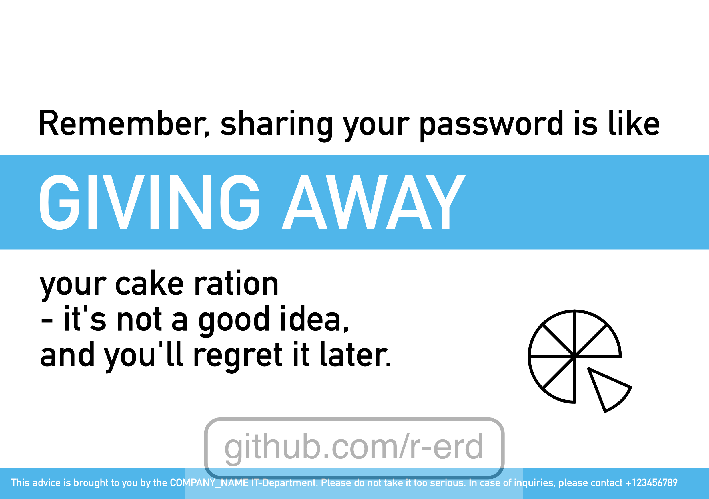

# IT-Security Awareness Cards
Introducing a fresh approach to IT security awareness: humorous posters that engage, educate, and inspire!

In today's digital landscape, **cybersecurity is more important than ever**. However, getting employees to pay attention to and remember best practices can be a challenge. Traditional training sessions and bland reminders often fail to capture people's interest, leading to a lack of engagement and retention.

That's where my innovative IT security awareness posters come in. By combining eye-catching designs with witty, relatable humor, these posters are designed to grab employees' attention and make a lasting impression. Each poster focuses on a specific aspect of cybersecurity, such as password strength, phishing scams, or device security, and delivers its message in a way that's both entertaining and informative.

Imagine your employees chuckling at a poster that reads, "Do not test if downloading that 'FREE_ANTIVIRUS.exe' file from a suspicious email actually gives you free antivirus protection." Not only will they appreciate the humor, but they'll also be more likely to remember the underlying message about the dangers of downloading files from unknown sources.

The beauty of these posters lies in their versatility. By placing different posters in various areas of your office, you can create **a sense of discovery and anticipation among your employees**. As they move from one department to another, they'll encounter new posters, each with its own clever take on an IT security topic. This approach taps into people's natural curiosity, encouraging them to actively seek out and engage with the content.

Moreover, these posters serve as conversation starters. When employees encounter a particularly funny or thought-provoking poster, they're likely to share it with their colleagues, sparking discussions about the importance of cybersecurity and best practices. By fostering a culture of open communication and awareness, you can create a more secure and vigilant workplace.

Investing in these humorous IT security awareness posters is a smart choice for any organization looking to bolster its cybersecurity efforts. By **making IT security more engaging, memorable, and relatable**, you can help ensure that your employees are better equipped to protect your company's valuable data and systems.

If you're interested in learning more about how these posters can benefit your organization, please don't hesitate to reach out. I'd be happy to discuss your specific needs and tailor a package that suits your unique requirements.

> (The text above was generated by Claude 3 Opus)

> Disclaimer: The humor in these posters is inspired by the popular video game series, Portal, and its fictional universe. I believe that drawing inspiration from imaginative worlds can be a powerful way to capture people's attention and make complex topics more accessible. I encourage others to create similar posters that reference other beloved fictional universes, as this can help to further engage and educate employees about the importance of IT security. If you do create such posters, I'd love for you to share them with us, as I'm always looking for new and creative ways to spread the message of cybersecurity awareness.

## Showcase

#### "Generic" Collection
<div class="image-row">
    
    
    
    
</div>

<div class="image-row">
    
    
    
    
</div>

<div class="image-row">
    
    
    
    
</div>

#### "Thank You" Collection

<div class="imassets/age-row">
    
    
    
</div>

<div class="image-row">
    
    
    
</div>

#### "Remember" Collection

<div class="image-row">
    
    
    
</div>

<div class="image-row">
    
    
</div>

#### "Do Not" Collection

<div class="image-row">
    
    
    
    
</div>


## Dev

```
python3 postprocess.py png_exports watermark.png --output_folder=./assets
```

## Copyright / License

No license, so default copyright law applies. I retain all rights to my work (content of this repository), others are not permitted to use, reproduce, or distribute it without my explicit consent.

